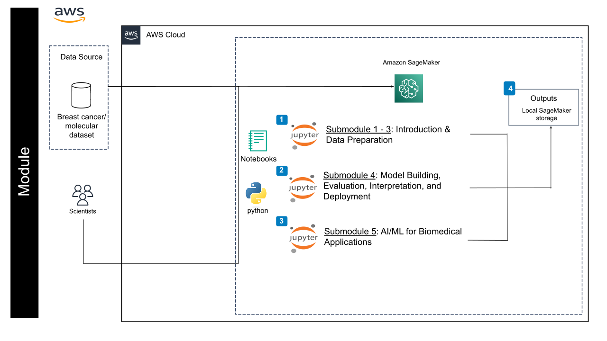

# Practical Data-Centric AI/ML for Biomedical Researchers
---------------------------------

## **Contents**

- [Practical Data-Centric AI/ML for Biomedical Researchers](#practical-data-centric-aiml-for-biomedical-researchers)
	- [**Overview**](#overview)
	- [**Background**](#background)
	- [**Software Requirements**](#software-requirements)
	- [**Before Starting**](#before-starting)
	- [**Getting Started**](#getting-started)
	- [**Architecture Design**](#architecture-design)
	- [**Data**](#data)
	- [**Module Outline**](#module-outline)
	- [**Funding**](#funding)
	- [**License for Data**](#license-for-data)
    - [**Contributors**](#contributors)
    - [**Acknowledgement**](#acknowledgement)

## **Overview**
The module prioritizes practical, data-centric techniques, ensuring researchers can immediately apply their acquired data science and AI/ML knowledge to real-world problems. We aim to train the participants with the competencies and skills needed to make biomedical data FAIR (Findability, Accessibility, Interoperability, and Reusability) and AI/ML-ready. The module also utilizes a blend of engaging instructional videos, interactive turorials, hands-on exercises to facilitate self-directed learning and knowledge retention. 

[Watch the Introduction video](https://drive.google.com/file/d/1bxpxzqK16nvi7jTMwY2gy8t_GkEG-XGr/view?usp=drive_link)

## **Background**
The landscape of biomedical research is experiencing a fundamental shift, transitioning from hypothesis-driven approaches to data-driven discoveries fueled by the large and complex datasets generated through high-throughput technologies. Effectively analyzing and extracting meaningful insights from these datasets requires researchers to be proficient in advanced computational methods such as Artificial Intelligence (AI) and Machine Learning (ML). Furthermore, cloud computing offers flexible, cost-effective, and powerful solutions for data storage, analysis, and collaboration without the infrastructure burden of individual institutions. However, unlocking the full potential of cloud-based AI/ML in biomedical research hinges on equipping researchers with the necessary skills and knowledge. Recognizing this gap, the National Institute of General Medical Sciences (NIGMS) launched the NIGMS Sandbox initiative, aiming to create a repository of cloud-based learning modules for diverse biomedical data science topics. This module, "Practical Data-Centric AI/ML for Biomedical Researchers" aligns perfectly with the NIGMS’s vision to expand the skilled workforce capable of harnessing the power of cloud computing and AI/ML. The module tackles the crucial challenge of upskilling biomedical researchers by equipping researchers with these skills to foster innovation, accelerate scientific discovery. By leveraging the NIGMS Sandbox and cloud platform, the module ensures broad accessibility. This democratizes access to cutting-edge knowledge, empowering researchers regardless of their institutional resources and fostering a more inclusive research landscape. 

## **Software Requirements**

These notebooks were designed to be used on AWS cloud computing platforms, with the aim of requiring nothing but the files within this GitHub repository. Therefore, software requirements should only require creation of SageMaker AI Notebook Instance and the downloading of this GitHub's files to that machine.

For more information on creating a virtual machine and downloading our GitHub repo to that machine, we have a before starting and getting started section below. Currently this section only includes information on how to do this using SageMaker AI on AWS Cloud Platform.

## **Before Starting**
1. Create an AWS Account:

* If you have a NIH Cloud Lab account, you can use that account.
* If you don't have NIH Cloud Labe account, you can sign up for a personel AWS account. You may need to provide credit card information, but you can often start with a free tier that offers a certain amount of free usage.

2. Launch a SageMaker AI Notebook Instance:

* Log into the AWS Management Console.
* Search for "SageMaker AI" and open the SageMaker AI service.
* Click on "Notebook Instances" and then "Create Notebook Instance".
* Instance Name: Give your instance a descriptive name.
* Instance Type: Choose a suitable instance type based on your computational needs. For basic data exploration and model training, a general-purpose instance like ml.t2.medium is sufficient.
* Notebook Instance Platform: Select the latest version of Jupyter Notebook.
* Storage: Configure the storage volume size for your instance (under "Additional Configureation").
* Network and Security: Set up appropriate network access and security groups to protect your instance. (Use default)
* Additional Configurations: Review and adjust other settings as needed, such as IAM roles and kernel configurations (User default).
* Click "Create Notebook Instance".

3. Access Your Notebook Instance:

* Once the instance is created, you can access it through the SageMaker AI console or directly via a web browser using the provided URL.

4. Set Up Your Environment:

* Install Required Libraries: Use the !pip install command to install necessary libraries like TensorFlow, PyTorch, Scikit-learn, Pandas, NumPy, etc.
* Import Libraries: Import the required libraries into your Python scripts or notebooks.
* Connect to Data Sources: Configure your instance to access data from various sources like S3 buckets, databases, or public datasets.

**Note**:You can use a normal sized AWS instance machine for most submodules (e.g. ml.t3.medium), but for Submodule 5 Exercise 2, you will need to provision a GPU-enabled instance type. (e.g., g4dn.xlarge for CUDA support, 50GB storage).

## **Getting Started**
1. Open a Terminal in Your SageMaker AI Notebook Instance, navigate to the Terminal tab in your SageMaker AI notebook instance.

2. Clone the Repository using the git clone command to clone our GitHub repository: 

```
git clone https://github.com/udel-cbcb/NIGMS-Sandbox-UD.git
```

3. Run the notebooks

We have five notebooks, each for a submodule.  From the Notebook Interface:
* Open the desired notebook file (e.g. submodule_1.ipynb) from the Jupyter Notebook interface.
* Select python3 kernel if not specified in the submodule notebook.
* Run the cells sequentially or selectively using the "Run" button or keyboard shortcut (usually Shift+Enter).

4. Notebook layout

Each notebook starts with some video lectures about the topics and quizzes to evaluate your understanding. Each notebooks also have some tutorials to help you learn how to implement the concepts and methods introduced in the lectures in Python code. We also provide Exercises (Solutions) for you to practice and check your own work.

## **Architecture Design**



## **Data**

| File Name | Summary | Details |
|---|---|---|
|[messy_data.csv](./Data/messy_data.csv)|The breast cancer dataset classifies breast cancer patient as either a recurrence or no recurrence of cancer. 'messy_data.csv' is modified from Breast Cancer Dataset so that various data cleaning techniques may be demonstrated. |[Breast Cancer Dataset](https://raw.githubusercontent.com/jbrownlee/Datasets/master/breast-cancer.names)|
|[pima-indians-diabetes.csv](./Data/pima-indians-diabetes.csv)|The dataset classifies patient as either an onset of diabetes within five years or not.|[Pima Indians Diabetes Dataset](https://raw.githubusercontent.com/jbrownlee/Datasets/master/pima-indians-diabetes.names)|
|[hepatitis.data](./Data/hepatitis.data)|The Hepatitis dataset is a medical dataset from the UCI Machine Learning Repository. It contains patient data related to hepatitis, which can be used for classification tasks, such as predicting patient survival.|[Hepatitis Dataset](https://archive.ics.uci.edu/dataset/46/hepatitis)|
|[wdbc.data](./Data/wdbc.data)|The Wisconsin Breast Cancer Dataset (WBCD) is a widely used dataset for breast cancer diagnosis. It contains features computed from digitized images of fine needle aspirate (FNA) of breast masses, which describe characteristics of cell nuclei.|[Wisconsin Breast Cancer Dataset](https://archive.ics.uci.edu/ml/datasets/Breast+Cancer+Wisconsin+%28Diagnostic%29)|
|[messy_wine_data.csv](./Data/messy_wine_data.csv)|The wine dataset is the results of a chemical analysis of wines grown in the same region in Italy by three different cultivators. 'messy_wine_data.csv' is a modified from 'Wine recognition dataset' by introducing some missing values.|[UCI Wine Dataset](https://www.kaggle.com/datasets/aarontanjaya/uci-wine-dataset)|
|[ecoli.csv](./Data/ecoli.csv)|Ecoli dataset is for predicting Protein Localization Sites in Ecoli.|[Ecoli Dataset](https://raw.githubusercontent.com/jbrownlee/Datasets/master/ecoli.names)|
|[tox21.csv]("../../Data/tox21.csv)|The “Toxicology in the 21st Century” (Tox21) initiative created a public database measuring toxicity of compounds, which has been used in the 2014 Tox21 Data Challenge. This dataset contains qualitative toxicity measurements for 8k compounds on 12 different targets, including nuclear receptors and stress response pathways.|[Toxicology Dataset](https://tripod.nih.gov/tox21/challenge/data.jsp)|
|[winequality-white.csv]("../../Data/winequality-white.csv"), [winequality-red.csv]("../../Data/winequality-red.csv") |The two datasets are related to red and white variants of the Portuguese "Vinho Verde" wine.|[Wine Quality Dataset](https://archive.ics.uci.edu/dataset/186/wine+quality)|
## **Module Outline**
**Submodule 1 - Introduction**

Learn AI/ML core concepts, diverse applications, introductory algorithms, ethical considerations, and data challenges.

- Lecture
  - Introduction to AI/ML
  - AI/ML Basic Concepts
  - AI/ML Applications
- Tutorial
  - Introduction to NumPy
  - Introduction to Pandas
- Exercise
  - NumPy Exercise
  - Pandas Exercise

**Submodule 2 - Data Science Life Cycle, FAIR Data Principles, Data-Centric AI/ML, and Responsible AI/ML**

Learn data science life cycle and FAIR principles for responsible data management. Systematically engineering the data used to build an AI/ML system, and understand fairness, transparency, and accountability in AI/ML development and deployment.

- Lecture
  - Data Science Life Cycle
  - FAIR Data Principles and FAIRness Metrics
  - Data-Centric AI/ML
  - Responsible AI/ML
- Tutorial
  - Data Centric AI/ML
  - Responsible AI/ML
- Exercise
  - Data Centric AI/ML
  - Responsible AI/ML

**Submodule 3 - Data Preparation**

Learn practical data cleaning techniques, as well as feature engineering, feature scaling, and feature selection techniques.

- Lecture
  - Data Collection and Data Preparation
  - Feature Engineering, Scaling and Selection
- Tutorial
	- Data Cleaning
	  - Basic Data Clearning
	  - Marking and Removal of Missing Data
	  - Outlier Identification and Removal
	  - Missing Data Imputation
	- Feature Engineering
	  - Encode Categorical Data
	  - Change Numerical Data Distribution
	  - Derive New Input Variables    
	- Feature Scaling
	  - Numerical Data
	  - Data With Outliers
	- Feature Selection
	  - Numerical Input Features
	  - Categorical Input Features
	  - Recursive Feature Elimination
- Exercise
	- Data Wrangling Exercise
	- Feature Engineering Exercise
	- Feature Scaling Exercise
	- Feature Selection Exercise

**Submodule 4 - Model Building, Evaluation, Interpretation, and Deployment**	 

Explore different AI/ML models and model evaluation techniques, delve into interpretability methods, and learn best practices for model deployment.

- Lecture
  - AI/ML Models and Model Evaluation
  - Model Tuning, Interpretation and Deployment
- Tutorial
  - Model Building and Evaluation
  - Model Tunning, Model Interpretation, Model Deployment
  - Predict Drug Activity for Androgen Receptor
- Exercise
  - Exploratory Analysis of Diabetes Risk Factors
  - Predicting Diabetes Risk

**Submodule 5 - AI/ML for Biomedical Applications**

Show different types of AI/ML algorithms and their suitability for biomedical data. Explore real-world examples of AI/ML in various areas of biomedicine.

- Lecture
  - AI/ML Applications in Biomedicine
  - Introduction to Deep Learning
- Tutorial
	- Pfam protein sequence classification using Tensorflow and Keras
    - Predicting the Solubility of Small Molecules
- Exercise
	- Predicting Predicting Diabetes Risk Deep Neural Network 
    - Protein 3D Structure Prediction using LocalColabFold

## **Funding**
The creation of this training module was supported by the National Institute Of General Medical Sciences of the National Institutes of Health under Award Number 3T32GM142603-03S1. Any opinions, findings, and conclusions, or recommendations expressed in this material are those of the authors and do not necessarily reflect the views 
of any of the funding agencies.

## **License for Data**
Text and materials are licensed under a Creative Commons CC-BY-NC-SA license. The license allows you to copy, remix and redistribute any of our publicly available materials, under the condition that you attribute the work (details in the license) and do not make profits from it.


This work is licensed under a [Creative Commons Attribution-NonCommercial-ShareAlike 4.0 International License](http://creativecommons.org/licenses/by-nc-sa/4.0/)

## **Contributors** 
The content of this training module was contributed by [Chuming Chen](mailto:chenc@udel.edu), [Cecilia Arighi](mailto:arighi@udel.edu), [Ryan Moore](mailto:moorer@udel.edu), [Amelia Harrison](mailto:aoh@udel.edu), and [Shawn Polson](mailto:polson@udel.edu).

## **Acknowledgement**
We would like to thank Alexa Bennett, Sylvia Kinya, Aaron Onserio and Deloitte team for reviewing and testing our module.

